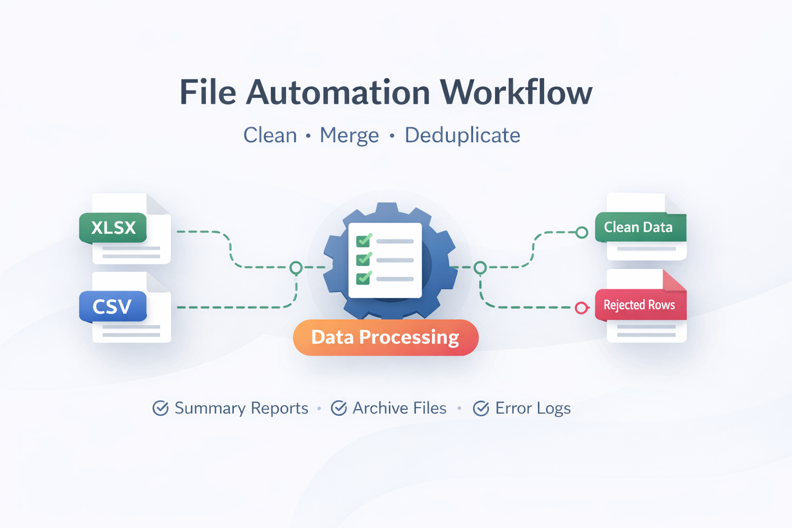

# Python File Automation Demo

A compact portfolio demo that shows how I build Python workflows for cleaning, standardizing, merging, and exporting business data with a simple UI.

**Live Demo:** [Demo URL](https://automation-demo.whotech.com.tw/)

> This repository is published for portfolio review and client evaluation.
> It is a demo, not a full production package.
> Production deployment, hardening, and client-specific implementation are provided as paid work.

## What This Demo Shows

- CSV / Excel cleanup workflow
- Column standardization and normalization
- Duplicate removal
- Summary and export generation
- Public webpage data intake into the same workflow
- A simple UI for non-technical users

## Typical Client Use Cases

- Cleaning messy spreadsheet exports
- Combining files from different teams or systems
- Standardizing customer or business records
- Turning repetitive data cleanup into a reusable workflow
- Building a small internal automation tool for operations teams

## Commercial Work

If you need a production-ready automation tool, custom rules, deployment support, or integration into your internal workflow, I provide that separately as paid client work.
